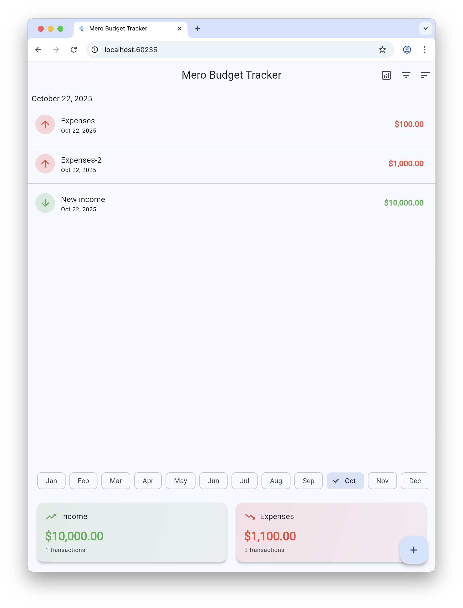
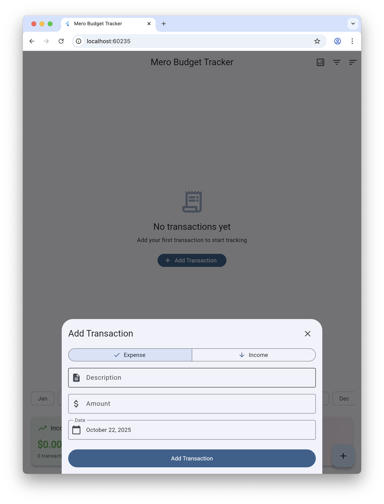
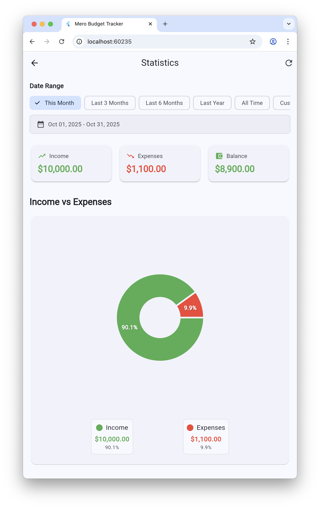

# ⚠️ Important Disclaimer


**This is an Experimental Project:**
- Approximately 90% of the code is generated using AI (Claude Sonnet3.5)
- This application is NOT intended for production use
- The codebase serves as an experimental playground for AI-assisted development
- May contain bugs, security issues, or incomplete features
- Use at your own risk for learning and experimental purposes only

# Mero Budget Tracker

A modern, feature-rich budget tracking application built with Flutter, implementing clean architecture and BLoC pattern for state management. This app helps users manage their personal finances effectively by tracking income and expenses.

## Introduction

Mero Budget Tracker is designed with a focus on:
- Clean Architecture principles
- Efficient state management using BLoC pattern
- Material Design 3 for modern UI/UX
- Scalable and maintainable codebase
- Comprehensive documentation

## Architecture

The project follows a clean architecture approach with three main layers:
- **Domain Layer**: Business logic and entities
- **Data Layer**: Data sources and repositories
- **Presentation Layer**: UI components and state management

## Features

### Current Features
1. **Transaction Management**
   - Add new transactions (income/expense)
   - View transaction history
   - Delete transactions
   - Update existing transactions

2. **State Management**
   - BLoC pattern implementation
   - Organized event handling
   - Consistent state updates
   - Error handling

3. **UI Components**
   - Material Design 3 theme
   - Responsive layout
   - Bottom sheet forms
   - Loading indicators
   - Error states handling

4. **Basic Analytics**
   - Transaction list view
   - Basic filtering
   - Simple calculations

### Planned Features
1. **Data Persistence**
   - Local storage implementation
   - Data backup and restore
   - Export functionality

2. **Advanced Analytics**
   - Category-wise breakdown
   - Monthly/yearly reports
   - Budget tracking
   - Spending patterns

3. **Categories Management**
   - Custom categories
   - Category-based filtering
   - Budget limits per category

4. **Multi-currency Support**
   - Multiple currency accounts
   - Exchange rate conversion
   - Base currency selection

## Documentation

- [Basic BLoC Implementation](docs/basic-bloc-implementation.md)
- [Add Transaction Feature](docs/add-transaction.md)
- [Next Improvements](docs/2-next-improvements.md)
- [Database Comparison](docs/database-comparison.md)

## Getting Started

### Prerequisites
- Flutter SDK (^3.7.0)
- Dart SDK
- VS Code or Android Studio
- Git

### Installation

1. Clone the repository
```bash
git clone https://github.com/dotnepal/mero-budget-tracker.git
cd mero_budget_tracker
```

2. Install dependencies
```bash
flutter pub get
```

3. Run the application
```bash
flutter run -d chrome
```

## Contributing

1. Fork the repository
2. Create your feature branch (`git checkout -b feature/amazing-feature`)
3. Commit your changes (`git commit -m 'Add some amazing feature'`)
4. Push to the branch (`git push origin feature/amazing-feature`)
5. Open a Pull Request

## License

This project is licensed under the MIT License - see the [LICENSE](LICENSE) file for details.

## Acknowledgments

- Built with Flutter
- State management using flutter_bloc
- Documentation assistance by Claude Sonnet3.5

## Some Screenshots

### Homepage


### Add Transaction


### Statistics

